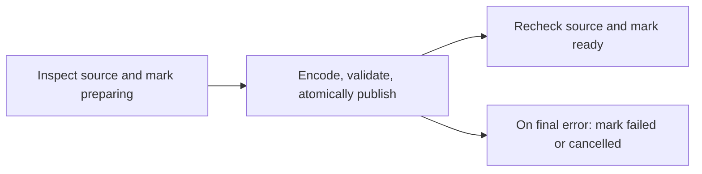

# Lab 04: Durable Video Preparation With Cadence

This slice prepares one selected video with one host-local Go worker. SQLite remains the catalog; Cadence owns durable execution history, activity retries, and cancellation. The existing synchronous mode still works without Cadence.

## Start the Local Services

Install and start Docker Desktop, then run from the project root:

```sh
docker compose -f compose.cadence.yaml up -d
docker compose -f compose.cadence.yaml logs --tail=30 cadence
```

The pinned stack uses Cadence server `v1.3.5-auto-setup`, PostgreSQL `17.4`, and Cadence Web `v4.0.0`. The Go SDK is `v1.3.1`. The web image requires amd64 emulation on Apple Silicon. Schema setup can take a little time; a worker started before the frontend is ready can fail its 15-second registration request. Retry the worker command after startup completes.

Only the gRPC frontend (`127.0.0.1:7833`) and web UI (`127.0.0.1:8088`) are published. PostgreSQL is private to the Compose network. These services have no application authentication and are for local learning only; do not expose their ports to your LAN or the internet. The database password in Compose is a local-development value, not a production credential.

In one terminal, start the worker:

```sh
go run ./cmd/worker -library .streamer/samples
```

The worker registers the `frame-local` domain if absent, with seven days of closed-workflow history retention. Open <http://localhost:8088> and select that domain. Use `-register-domain=false` with a pre-provisioned domain. `-cadence-address` and `-cadence-domain` are available on both commands.

In another terminal, submit and watch your selected file:

```sh
go run ./cmd/streamer -cadence \
  -library .streamer/samples \
  -input .streamer/samples/adaptive-720p.mp4
```

Use an existing sample or substitute your own library and input. Build the frontend as described in the README first. If port 8080 is busy, add `-port 8081`. Open the printed application URL after `Ready` appears.

Both processes must use the same host, `-library`, `-cache`, and `-data` paths. Defaults are `.streamer/cache` and `.streamer/frame.db`. Their absolute paths and hostname determine the task list printed by the worker. A mismatched configuration queues work on a task list with no matching worker. Use exactly one worker for that configuration, and do not run synchronous preparation against the same catalog/cache concurrently. A catalog rejects changing its library root; use a separate database for another library.

## Read the History



- `frame.prepare.v1` is deterministic workflow code. It schedules activities and waits for their results. No FFmpeg, SQLite, filesystem access, goroutines, or wall-clock reads run in the workflow.
- `frame.inspect.v1` probes the source and writes its preparing catalog record. Its result contains a relative source path, fingerprint, and metadata. Inspection errors before a record exists appear in Cadence only.
- `frame.encode-validate-publish.v1` owns the existing media preparation transaction: unique staging directory, encoding, validation, source recheck, and atomic rename into the cache. These remain together because publication already has a tested retry boundary.
- `frame.mark-ready.v1` verifies the source has not changed and upserts playback metadata into SQLite. It can safely repeat if its successful response is lost.
- `frame.mark-failed.v1` records a final error or cancellation after inspection. It cannot overwrite a ready record or a different source fingerprint. Cleanup uses a disconnected workflow context so a cancellation can still schedule it.

No media bytes or absolute source paths are intentionally passed as activity inputs/results. Relative filenames and bounded tool errors are still private metadata in Cadence history; diagnostics may contain paths. The fingerprint travels explicitly in the activity snapshot because the public video JSON deliberately excludes it.

The workflow ID is stable for a task list and relative source path. Starting the same source while it is running attaches to that execution. Starting it after completion creates another run, which inspects the current source and reuses a valid completed cache. Source identity uses path, size, and modification time, not a full content hash; do not modify inputs while preparing them.

## Retry and Cancellation Experiments

Use a longer clip or a new cache directory to make preparation last long enough to observe. Pass any new cache path to both commands.

1. Start a preparation and watch its history in Cadence Web.
2. Press Ctrl+C in the streamer while it waits. The workflow continues. Run the same streamer command to attach again.
3. Stop the worker during encoding, then restart it with the same flags. Graceful stop kills its FFmpeg process and returns a retryable activity error. A hard worker crash is detected after its heartbeat expires; FFmpeg may outlive a forcibly killed worker, so inspect local processes before restarting after a hard kill. Cadence retries the activity, not an FFmpeg byte-offset checkpoint.
4. Request cancellation from a third terminal, with the same library/cache/data configuration:

```sh
go run ./cmd/worker -library .streamer/samples -cancel adaptive-720p.mp4
```

Leave a worker running to deliver cancellation and finish cleanup. While encoding, heartbeats every five seconds let the SDK receive cancellation; `exec.CommandContext` stops FFmpeg and the preparation removes its staging directory. Cadence may throttle heartbeats, so cancellation is not instantaneous. Cancelling after publication may leave an immutable completed cache; it is safe to reuse later. A late cancellation does not undo a committed ready record.

Encoding has a 30-second heartbeat timeout and a 12-hour per-attempt timeout, with at most three attempts and exponential backoff. Inspection/catalog activities also have three attempts. Known source-version mismatches are non-retryable; other errors have bounded retries. The workflow has a 72-hour total deadline, including queue time. Heartbeats report liveness and output identity, not percentage complete.

## Recovery Boundaries

Activities are at-least-once. If the worker publishes media but dies before acknowledging completion, the retry validates and reuses that cache. If SQLite was updated but the acknowledgement was lost, the upsert repeats. A hard crash may leave an unserved `.preparing-*` directory; this slice does not automatically remove abandoned staging directories.

Stopping Compose preserves Cadence history in its named PostgreSQL volume:

```sh
docker compose -f compose.cadence.yaml down
```

Do not use `down -v` unless you intend to delete all local workflow history. Source media, cache, and SQLite live on the host, not in this volume. Keep these stores together when planning recovery; losing Cadence history is different from losing prepared output.

Force-terminating a workflow, exhausting its overall deadline, or losing the catalog during cleanup can leave a stale `preparing` state. Cadence history is authoritative for execution state; automatic reconciliation is not implemented yet. Source changes after completion also need a future rescan. Folder discovery, multi-video APIs/UI, queued-job screens, disk quotas, and a catalog-backed playback lookup remain later slices. HTTP still starts only when the selected workflow completes.

Workflow implementations must remain replay-compatible with existing histories. Do not reorder these activities or change their arguments while runs are open; use Cadence versioning or a new workflow type for future incompatible changes. Changing encoding profiles while a run is in flight is rejected when its output identity no longer matches inspection.

## Verify Without a Cadence Server

```sh
go test ./internal/preparation ./internal/store ./cmd/...
STREAMER_INTEGRATION=1 go test ./internal/preparation ./internal/media
```

The SDK test harness covers success, transient retry, non-retryable failure, cancellation, and duplicate client attachment. Real FFmpeg activity tests cover serialized fingerprints, unchanged published output on retry, source replacement, ready-state idempotency, graceful worker stop, and cancellation. These checks do not replace the live server/restart experiment or real Windows/iOS testing.

## Live Verification

Verified on this Mac on 2026-09-26 with the pinned Compose stack:

- A fresh preparation completed through Cadence, published a ready SQLite record, and passed desktop and phone-sized Chrome playback tests.
- Interrupting the worker during a five-minute clip caused a heartbeat timeout. After worker restart, activity attempt `1` completed under the original workflow run ID and the catalog became ready.
- Stopping and restarting the waiting streamer attached to the same active run ID without starting another preparation.
- The explicit cancellation command closed the workflow as `CANCELED` and recorded `cancelled` in SQLite with no ready version.

Interrupting `go run` in this environment exercised heartbeat-timeout recovery, not an acknowledged graceful activity exit. It left one abandoned, unserved staging directory, removed after verification. Graceful worker-stop behavior is covered separately by the SDK activity tests; automatic abandoned-directory cleanup remains unimplemented.

The live test used `-cache .streamer/cadence-cache -data .streamer/cadence.db` on both processes to keep it separate from the original demo. Cadence Web is at <http://localhost:8088>, domain `frame-local`; the Cadence-prepared sample app runs on port 8081 while those processes remain running.
