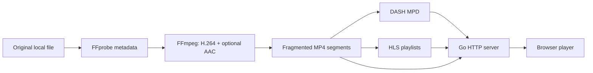

# Lab 01: From a File to a Stream

## Container, Codec, Protocol

MKV and MP4 are **containers** holding encoded video, audio, and other tracks. H.264, HEVC, and AAC are **codecs** describing compression. **DASH** describes discovering and requesting a presentation over HTTP. Renaming an MKV does not convert a codec; serving an MP4 does not automatically make it adaptive streaming.

Frame now prepares a source-aware adaptive bitrate ladder. A small source can still produce one representation because Frame never upscales it. Lab 02 explores sources with multiple eligible representations.



The output is SDR H.264, square pixels, even dimensions, at most 1920 x 1080, and 30 fps. Default audio (or the first audio track) becomes stereo AAC shared by DASH and HLS. Silent videos have no audio adaptation set. HDR/BT.2020 is rejected. Scaling preserves display aspect ratio; originals are never modified.

Encoding is expensive. Afterwards, watching mostly costs disk reads and network bandwidth. Each viewer requests the prepared bytes independently; watching does not spawn another FFmpeg encoder.

## Experiment 1: Inspect Your Source

```sh
ffprobe -v error -show_format -show_streams -of json "/path/to/video.mp4"
```

Identify container, video/audio codecs, dimensions, duration, sample aspect ratio, and color transfer. An MP4 can contain HEVC rather than H.264. Frame reads this structured JSON, not FFprobe's human-readable stderr.

## Experiment 2: Follow the Requests

1. Start the demo and open developer tools' Network panel.
2. Click Watch now, select DASH, and press Play. Filter for `mpd`, `m4s`, or `mp4`.
3. Open the MPD through the Manifest link. `type="static"` identifies completed on-demand content.
4. Find `AdaptationSet`, `Representation`, and `SegmentTemplate`. Video and audio have separate adaptation sets.
5. Inspect initialization and media-segment requests, including Content-Type, size, and timing.

The MPD is a map, not the video. Initialization segments carry track/codec setup. Media segments carry timed encoded samples. A lone media segment generally needs the initialization data to decode.

```text
GET /api/video
GET /media/<id>/manifest.mpd
GET /media/<id>/init-stream0.m4s
GET /media/<id>/init-stream1.m4s       (if audio exists)
GET /media/<id>/chunk-stream0-00001.m4s
GET /media/<id>/chunk-stream1-00001.m4s
... additional segments as needed ...
```

In `SegmentTimeline`, `d` is a duration in ticks: divide by `timescale` for seconds. `r` counts additional repeats, so `r="2"` describes three segments. Audio boundaries can differ slightly from video because of encoded audio sample timing.

The server does not push an endless video stream. The player chooses what to fetch next. Shaka uses the browser's MediaSource APIs to supply the decoder with encoded media.

## Experiment 3: Seek and Buffer

1. Play several seconds and observe Buffer ahead and Playback position.
2. Seek to an unbuffered point and watch which segment numbers are requested next.
3. Pause. Downloads may continue until the player's buffering target is reached.
4. Throttle the network. With a 720p or larger source, watch Shaka request a lower representation as its bandwidth estimate changes. A small source may have only one eligible representation and can still stall.

Keyframes provide independently decodable entry points. This profile uses closed GOPs, 30 fps, a 120-frame keyframe interval, and forced four-second keyframes. Every video representation uses the same segment timeline so the player can switch at aligned boundaries.

Inspect byte ranges separately, substituting the real ID from your manifest URL:

```sh
curl -i -H "Range: bytes=0-31" "http://localhost:8080/media/<id>/chunk-stream0-00001.m4s"
```

Expect `206 Partial Content` and a matching `Content-Range`. This multi-file DASH layout generally requests entire small segments. Supporting ranges is useful for clients and other layouts; it is not itself what makes the playback DASH.

## Experiment 4: Compare HLS

Select HLS and inspect its master and media playlists. HLS playlists are text rather than DASH's XML. Both protocols reference the same prepared fragmented MP4 segments here, so HLS does not require a second encode.

Apple browsers use native HLS where available. Some current Chrome versions support it too; Frame deliberately defaults Chrome to DASH for learning. Explicit HLS uses native playback when possible, otherwise Shaka.

Native playback exposes fewer internals. Frame shows estimated bandwidth as unavailable in native mode. Buffer ranges and frame counters come from the video element; browser implementations differ. Bandwidth estimates and dropped-frame counts are not picture-quality measurements.

## Storage and Publication

Encoding writes a private staging directory. Frame checks MPD-referenced segments, required playlists, and the poster before publishing the completed directory. Failed work is never presented as ready. A source fingerprint protects against source changes during preparation and gives finished outputs their own immutable URLs.

The encoder uses constrained quality with a 5 Mbps video maximum rate and 128 kbps audio target. Actual average bitrate varies. Estimate storage as average bitrate multiplied by duration, divided by eight, plus container overhead. For multiple stored qualities, sum all rendition bitrates, even though a viewer fetches only one quality at a time. This is not a disk-space guarantee or enforced quota.

Prepared media uses private, long-lived browser caching; API metadata is not cached. New source versions get new URLs rather than replacing segments already buffered by a viewer.

## Continue to Lab 02

- Verify sound, user-initiated play, seek, completion, and resume on actual Safari/iPhone/iPad.
- Verify native Windows startup and independent playback on two LAN devices.
- Note preparation time and additional storage for a representative file.

Continue with [Lab 02](streaming-lab-02.md) to inspect the quality ladder and observe automatic selection under changing bandwidth. Folder indexing, background preparation, SQLite, and a larger library follow after that pipeline is understood and verified.

References: [FFmpeg DASH muxer](https://ffmpeg.org/ffmpeg-formats.html#dash-2), [Shaka Player](https://github.com/shaka-project/shaka-player), [DASH Industry Forum](https://dashif.org/), [Apple HLS](https://developer.apple.com/streaming/).